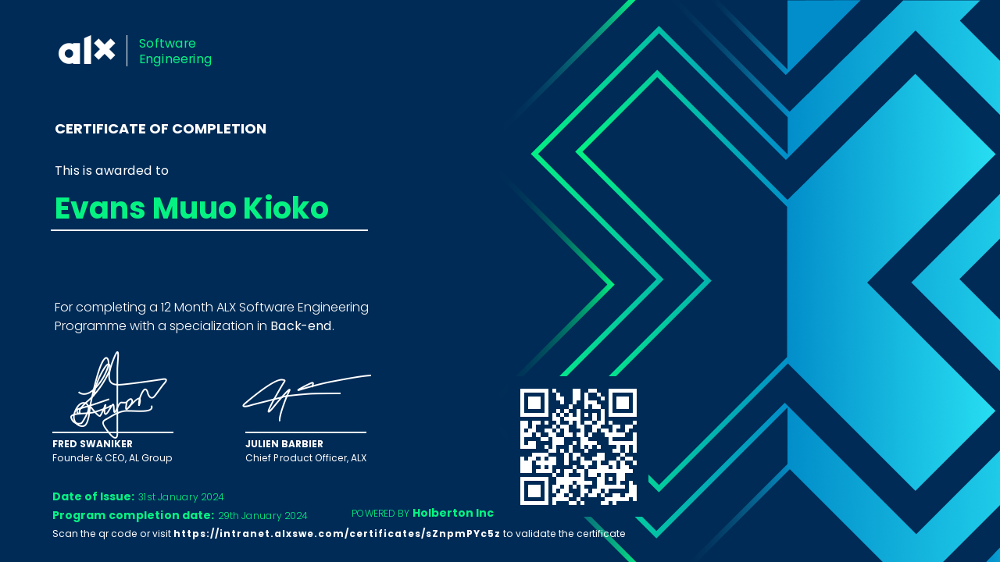
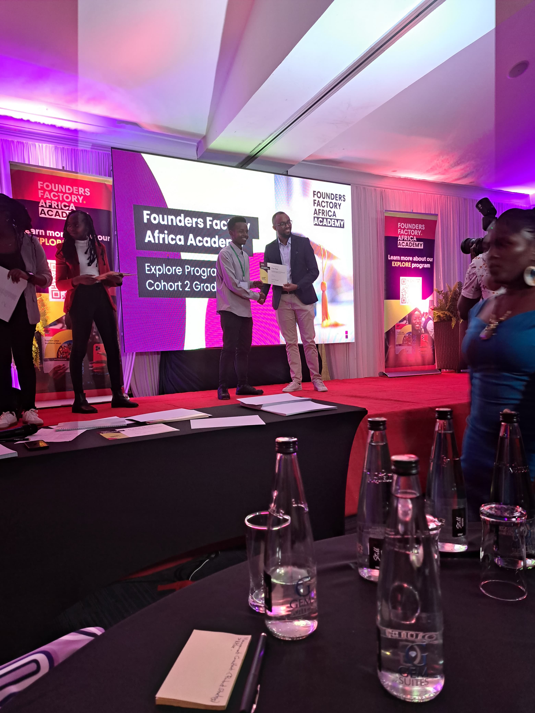
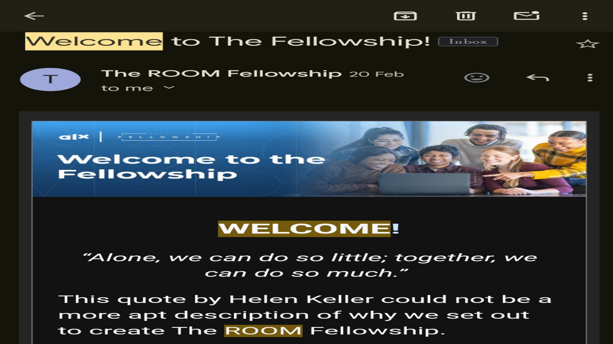



Hello there my name is Evans Muuo Kioko. I am a `Software developer` with a burning desire for `entrepreneuship`. I am from Nairobi Kenya.
I find my home in the wide world 🌐 of digital innovation, propelled by an unwavering passion for software development with Artificial Intelligence that permeates every code I write. My first curiosity about the skill of creating solutions from the ethereal world of ones and zeros developed into a steadfast dedication during my formative years. It involves more than just creating programs; it involves giving pixels and algorithms life and molding aspirations into reality. The infinite opportunities in this always changing area entice me, and every obstacle feels like a siren's song, kindling my inner fire to push boundaries and redefine what is possible. Here, where imagination soars via code and creativity and logic collide, I discover my `purpose`


## Professional Journey
### Education
My professional journey is anchored by a commitment to continuous learning and academic excellence.
#### `University of the People,`[UoPeople](https://www.uopeople.edu/) `BSc. Computer Science 28th sept 2021 - 30th Nov 2025.` - Ongoing
At present, I am actively pursuing a degree in Computer Science at the University of the People, immersing myself in the dynamic realm of algorithms, data structures, and software engineering principles. 

#### `WorldQUant University`- Ongoing
I am actively learning about DS and how I can apply the knowledge I acquire in building better solutions for humans.

#### `African Leardeship X`[ (ALX)](https://www.alxafrica.com/)`, Certificate Software Engineering. June,2022-Jan,2024.` - Completed
Prior to this, I fortified my skill set with a Software Engineering certificate from ALX, where I honed my abilities in crafting robust, scalable solutions. 

#### `Founders Factory Africa`[ (FFA)](https://www.ffa.com/)`, Certificate Entrepreneurship. Mar, 2024-May, 2024.`-Completed

Learnt how to validate business ideas, how to target the correct customer segment, how to prototype and Finally pitch.


### Work Experience

#### `Chief Technology Officer (CTO) at` [ `Kiota`](https://www.mykiota.com)

  1. Spearheaded innovative software solutions, leveraging cutting-edge technology to drive business growth and efficiency at Kiota.
  2. Managed and mentored a talented team of developers, fostering collaboration and excellence in project delivery.
  3.Ensured the quality and timely completion of projects, overseeing the entire development lifecycle from conception to deployment.

#### `Technical Writer at`  [`MuuoCodes`](https://www.muuo.codes)

  1. Utilized my software engineering background to craft comprehensive technical documentation, enhancing the accessibility and usability of MuuoCodes' products.
  2. Communicated complex technical concepts in clear, concise language, facilitating seamless understanding for end-users and stakeholders.

#### `Fellow at The Room`

  1. Contributed to the development of impactful web and mobile applications aimed at driving social change and community empowerment.
  2. Collaborated closely with cross-functional teams to design and implement robust software solutions aligned with project objectives and user needs.

### Additional Roles and Contributions
#### `Ambassador and Mentor at University of the People:` 
Actively engaged in promoting academic excellence and fostering a supportive learning environment as an ambassador and mentor for fellow students.
#### `Intern at International MUN:` 
Leveraged strong communication and leadership skills to facilitate global dialogue and cooperation on critical issues, contributing to meaningful diplomatic efforts.

## Projects

<!-- - Brief description of the project.
- Technologies used.
- Your role and contributions.
- Results or impact of the project. -->
### Project 1:[ KIOTA](https://www.mykiota.com)
#### Overview
In the journey of building a scalable fintech solution aimed at enhancing retirement planning for employees, Kiota was conceived. This documentation encapsulates the project's evolution, outlining specific requirements and proposing an architecture to realize the system's vision. Kiota aims to streamline pension services for employers, third-party administrators, and savers alike.

#### Features
The system boasts several key features tailored to different user roles:

    Authentication: Secure access for super admin (Kiota), savers, employers, and third-party administrators.
    Dashboards: Customized dashboards offering pertinent information for each user category.
    Saver Dashboard: Personal details, contribution statements, retirement projections, and more.
    Employer Dashboard: Plan details, staff metrics, contribution tracking, and company insights.
    Third-Party Administrator (TPA) Dashboard: Company overview, onboarding tools, and management features.
    
#### Technologies Used
    Frontend: React JavaScript
    Backend: PostgreSQL, AWS, Google Cloud
    Other Tools: MongoDB (for non-relational database needs)

#### Role and Contributions
As the CTO of Kiota, my responsibilities encompassed:

  1. Architecting the system to ensure scalability, security, and efficiency.
Overseeing the implementation of best practices in coding, database design, and security protocols.
  2. Collaborating with the development team to align technical solutions with project requirements.
  3. Ensuring seamless integration of various technologies to deliver a cohesive user experience.

#### Results or Impact
  Kiota emerged as a robust fintech solution, empowering employers and savers with intuitive tools for retirement planning. The system's user-centric design and secure infrastructure garnered positive feedback, driving adoption rates and fostering financial well-being among users. Kiota's success underscored the transformative potential of technology in revolutionizing pension services, paving the way for future innovations in the field.

### Project 2: [PAYBUDDY](https://github.com/Muuocodes/payapi)
<!-- - Repeat -->

## Skills
<!-- - List your technical skills, programming languages, frameworks, tools, etc.
- Optionally, rate your proficiency level for each skill. -->

#### Programming Languages
- **Python:** Proficient
- **Java:** Proficient
- **C++:** Proficient
- **R:** Proficient

#### Machine Learning Frameworks
- **TensorFlow:** Proficient
- **PyTorch:** Proficient
- **Scikit-learn:** Proficient
- **Keras:** Proficient

#### Deep Learning Frameworks
- **TensorFlow:** Proficient
- **PyTorch:** Proficient
- **Keras:** Proficient

#### Natural Language Processing (NLP) Libraries
- **NLTK:** Proficient
- **spaCy:** Proficient
- **Gensim:** Proficient

#### Computer Vision Frameworks
- **OpenCV:** Proficient
- **TensorFlow:** Proficient
- **PyTorch:** Proficient

#### Data Analysis and Visualization
- **Pandas:** Proficient
- **NumPy:** Proficient
- **Matplotlib:** Proficient
- **Seaborn:** Proficient

#### Cloud Computing Platforms
- **Amazon Web Services (AWS):** Proficient
- **Google Cloud Platform (GCP):** Proficient
- **Microsoft Azure:** Intermediate

#### Database Management Systems
- **SQL:** Proficient
- **MongoDB:** Proficient
- **PostgreSQL:** Proficient
- **SQLite:** Proficient

#### Development Tools
- **Git:** Proficient
- **Docker:** Proficient
- **Jupyter Notebooks:** Proficient
- **Visual Studio Code:** Proficient

#### Other Skills
- **Reinforcement Learning:** Proficient
- **Time Series Analysis:** Intermediate
- **Transfer Learning:** Intermediate
- **Model Deployment:** Intermediate

## What People Say About Me
<!-- - Include any recommendations or testimonials from colleagues, supervisors, or clients if available. -->

### Joseph Kammata, Senior IT officer at KUTRRH.
`"Working with Evans has been an absolute pleasure. His deep understanding of AI coupled with strong problem-solving skills have consistently impressed our team. Evans has a knack for diving into complex challenges and delivering elegant solutions that exceed expectations."`

### `Anonymous` @ [MuuoCodes](https://muuo.codes).
`"Evans is an invaluable asset to any project or team. His dedication to excellence, coupled with their collaborative spirit, makes them a standout performer. I have no hesitation in recommending Evans for any role requiring expertise in software development and AI."`

### Ali Ali, CEO of [KIOTA](https://www.mykiota.com).
`"Evans is an invaluable asset to any project or team. His dedication to excellence, coupled with their collaborative spirit, makes them a standout performer. I have no hesitation in recommending Evans for any role requiring expertise in software development and AI."`

<!-- ### MuuoCodes
"Lorem ipsum dolor sit amet, consectetur adipiscing elit. Sed gravida arcu at ante ultricies, sed vulputate ex vehicula. Nulla facilisi. Praesent ac elit sit amet odio ullamcorper sagittis. Vestibulum ante ipsum primis in faucibus orci luctus et ultrices posuere cubilia Curae; Sed vel erat vel ante maximus fermentum." -->

## Fun Facts
<!-- - Share a bit about your personality, hobbies, or interests outside of work.
- This helps to humanize your portfolio and make a personal connection with the reader. -->

As much as I thrive in the world of technology, I also find joy in exploring diverse interests beyond the confines of code. You might find me lost in the pages of a gripping novel, immersing myself in the rich tapestry of storytelling. I have a passion for photography, capturing moments frozen in time that evoke emotion and spark imagination. When the opportunity arises, I enjoy embarking on outdoor adventures, whether it's hiking through rugged trails or basking in the serenity of nature. Ultimately, it's the balance between my love for technology and these enriching experiences that fuels my creativity and drives me to make a meaningful impact in both professional and personal spheres.


## Contact Information
<!-- - Provide ways to contact you, such as email, LinkedIn profile, or portfolio website. -->
Feel free to reach out to me through any of the following channels:

- **Email:** [evans@muuo.codes](mailto:your.email@example.com)
- **LinkedIn:** [My Profile](https://www.linkedin.com/in/evansmuuo/)
- **GitHub:** [My Profile](https://github.com/codelord-evans)
- **Portfolio Website:** [Evans Muuo Portfolio Website](https://www.muuo.codes/portfolio)

## Conclusion
<!-- - Thank the reader for visiting your portfolio and express your enthusiasm for future opportunities. -->
Thank you for taking the time to explore my portfolio. I hope you gained insight into my skills, experiences, and passion for software development. I'm excited about the possibility of collaborating on future projects and opportunities!

## Updates
<!-- - Mention that your portfolio is regularly updated with new projects and achievements. -->
My portfolio is regularly updated with new projects and achievements, reflecting my ongoing growth and development as a software developer. Be sure to check back periodically for the latest updates and innovations.

## Acknowledgment
<!-- - (Optional) Acknowledge any tools or frameworks used to create your portfolio. -->
I would like to acknowledge the tools and frameworks that contributed to the creation of this portfolio, including Markdown for formatting, GitHub Pages for hosting, and any other technologies that helped bring this showcase to life.

