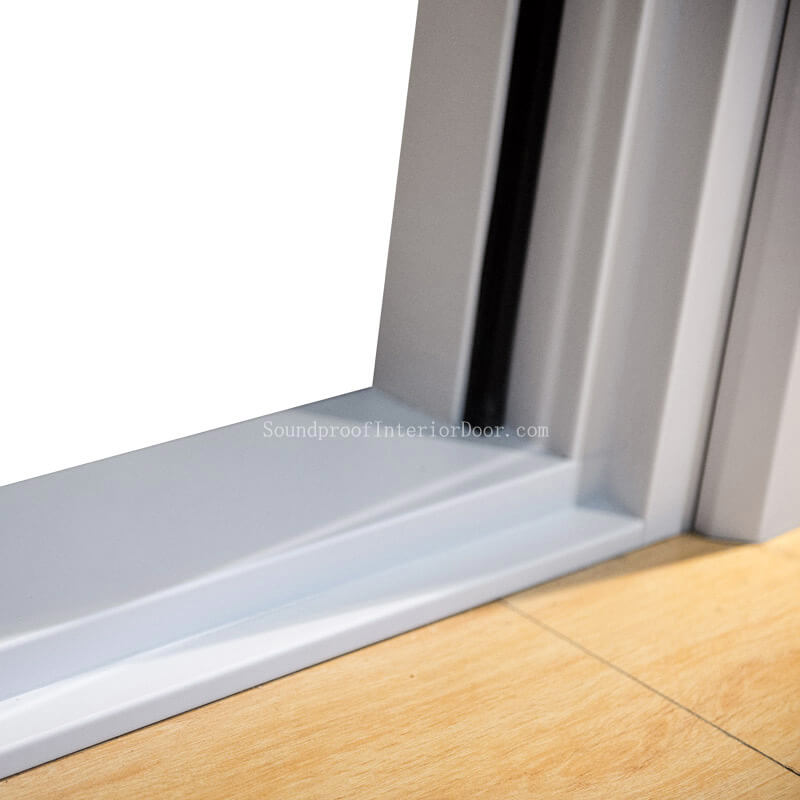

Home Theater Doors Chinese Factory Acoustic Double Soundproofing Acoustic Door Steel Door

Our policy has always been growing with clients, thus we streamline our efforts to achieve this vision of us. It has always been our concern to offer absolute solution to the acoustic requirements of all the industries. Sophisticated machines of sound blocking interior doors are installed in our manufacturing units along with latest testing amenities.

We have obtained a big sales network covering remodeling contractors, remodeling general contractors, infrastructure development firms, and other customers. ServiceN provides you with global door-to-door express cargo transportation services, including domestic and international express services and reverse logistics company solutions. ZWQXQE is a complete service design/build renovation team, including interior designers and carpenters. Interior decoration represents the highest quality. FJPNZ provides professional basement renovation and basement conversion services for homeowners in Columbus, Marysville and the surrounding areas of Ohio. DesignFD experts assist builders, designers and real estate developers in Brisbane, Sydney, Gold Coast, Melbourne and Perth Australia and New Zealand. OCJYTB offers low-cost classic-looking suspended ceilings in various styles and options, commercial decorative interiors and floor-to-ceiling wooden ceilings.

Our products are very popular in Guayaquil Ecuador, Gurayat Saudi Arabia, Chesterfield United Kingdom, Nancy France, San Diego, Tando Allahyar Pakistan, Giugliano in Campania Italy, Dehradun India, Jiddah Saudi Arabia, Chinhae Korea (South), Jalgaon India, Kherson Ukraine, and other regions.

Fashion Steel Material Acoustic Doors Bottom Seal Hardware Saving Soundproof Door

I am writing to inquire on pricing for your soundproof interior doors. The door We require is not standard. Can you confirm that you are able to manufacturer a non standard door and how your process works? What information do you require in order for us to receive a quote?

Having worked for more almost 2 decades in the Interiors / Building materials and Fit out industry within the Middle East region and Asia, We embarked on a mission to put users at the center of commercial interiors. In 2014, it was formed with the most versatile and comprehensive range of high-performance Acoustic and Interior design products offering new aesthetics, cutting-edge technology, world class quality and customized design services to meet most needs, applications and budgets.

There are extensive wall and ceiling applications such as technology college, dance room, administrative centre, lecture hall & meeting room, resort hotel, hotel ballroom, university performing arts center, audio-visual room, lecture hall, technology center, conference room & meeting room, etc.

You will be right to choose us as your permanent supplier.
Website: https://www.soundproofinteriordoor.com/product/soundproof-commercial-steel-doors/

