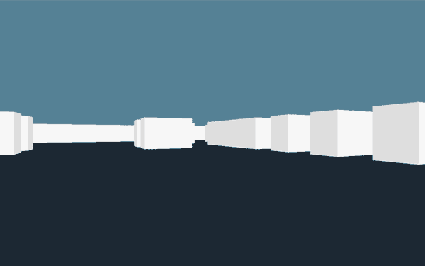

Welcome to my blog post, where I'll take you on a deep dive into the development journey of my exciting 2D Maze Game. In this post, I'll share the inspiration behind the project, discuss the technologies and architecture I utilized, highlight key features, and delve into the challenges and learnings I encountered along the way. Let's embark on this immersive adventure!


## The Purpose of the Project.
The purpose of my project was to create an engaging and challenging 2D maze game that tests players' problem-solving skills. I wanted to provide a captivating gaming experience that offers both entertainment and a sense of accomplishment. My goal was to develop a game that would appeal to a wide audience, from casual gamers looking for a quick diversion to avid gamers seeking a thrilling maze-solving adventure.

## Inspiration and Motivation.
The inspiration for the 2D Maze Game came from our collective love for puzzles and the joy they bring. I was inspired by classic maze games and wanted to create a modern and immersive experience that would resonate with players. The challenge of navigating intricate mazes, the sense of accomplishment upon completion, and the opportunity for strategic thinking all motivated me to embark on this project.

## Technologies and Architecture.
To bring the 2D Maze Game to life, I utilized the following technologies and architecture:

`Frontend Technologies`: For the frontend development, I chose to use HTML5, CSS3, and JavaScript. I opted not to use any additional frameworks to solidify our understanding of core web technologies and ensure a lightweight and fast gaming experience.

`Backend Technologies`: The backend of my game was built using Node.js and Express.js. These technologies provided a robust and scalable server-side framework, enabling me to handle game logic, database interactions, and user authentication.

`Database`: I utilized MongoDB as my database system to store player scores, progress, and other game-related data. MongoDB's flexibility and scalability were well-suited for my project's requirements.

`APIs`: I created custom APIs for user registration, score tracking, and leaderboard functionality. These APIs allowed seamless communication between the front-end and back-end, ensuring a smooth gaming experience.

```c
#include <stdio.h>
#include <stdlib.h>

// Function to get player score
int getPlayerScore(int playerId) {
    // TODO: Retrieve player score from the database
    // You would typically have your own implementation to access the database and fetch the score

    // For this example, we'll assume a static score for demonstration purposes
    if (playerId == 1) {
        return 100;
    } else if (playerId == 2) {
        return 150;
    } else {
        return -1; // Return -1 for invalid player IDs or if the player is not found
    }
}

// API route to get player score
void getPlayerScoreAPI(int playerId) {
    int score = getPlayerScore(playerId);

    // Check if the player exists and return the score
    if (score != -1) {
        printf("Player score: %d\n", score);
    } else {
        printf("Player not found\n");
    }
}

// Example usage
int main() {
    // Call the API route to get the player score
    getPlayerScoreAPI(1);

    return 0;
}
```
Hosting Platform: I opted to deploy our game on a cloud hosting platform, AWS to be specific. This is because the plartform was the most suitable I found for scalability, reliability, and easy deployment options for my game.
## Key Features.
Throughout the development process, I implemented several key features that enhanced the gameplay experience:

`Maze Generation`: My game utilized advanced maze generation algorithms to ensure each playthrough offered a unique maze layout. This added variety and replay value for players.

`Player Controls`: I developed intuitive and responsive player controls, allowing smooth navigation through the maze. Players could move using keyboard inputs or touch gestures, depending on the device they were using.

`Scoring and Leaderboard`: I integrated a scoring system that rewarded players based on their completion time and efficiency in solving the maze. Players could compete against friends and other players worldwide on the leaderboard, fostering a sense of competition and camaraderie.


## Most Difficult Technical Challenge.
One of the most challenging technical aspects I encountered during the development process was implementing efficient collision detection. As players moved through the maze, we needed to ensure they couldn't pass through walls or obstacles. Achieving smooth and accurate collision detection required careful consideration of player movement, maze layout, and optimization techniques. We spent considerable time refining the algorithms and testing various scenarios to ensure an optimal gaming experience.

## Learnings and Personal Focus.
Working on this project allowed me to expand my technical skills and gain valuable insights. I deepened my understanding of game development principles, frontend and backend technologies, and collaborative project management. I honed our problem-solving abilities, improved our teamwork and communication, and developed a keen eye for user experience design. I also focused on personal growth in areas such as graphics design, animation, and quality assurance

## Summary and Conclusion.
In summary, my 2D Maze Game project was a journey filled with innovation, challenges, and achievements. I successfully created an immersive gaming experience that captivates players with its intricate maze layouts, intuitive controls, and competitive elements. The utilization of appropriate technologies and dedication to quality ensured the project's success.

Through this project, I not only accomplished my goal of building an engaging maze game but also fostered personal growth and deepened my passion for game development. I look forward to utilizing the knowledge and experience gained from this project in future endeavors.

Thank you for joining me on this exhilarating adventure! I hope you enjoyed this blog post and invite you to experience the thrill of our 2D Maze Game firsthand. 

 
check it out on 



References:

[Link to Deployed Site](https://github.com/codelord-evans/3D-Maze-Game)

[My LinkedIn Profile](https://www.linkedin.com/in/evansmuuo/)
