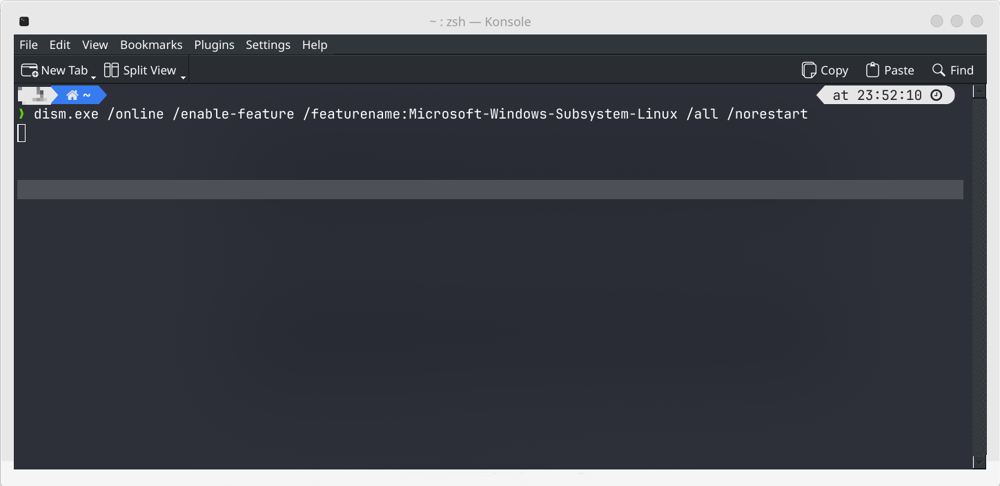

## Step By Step Guide

The Windows Subsystem for Linux (WSL) is a powerful feature that allows you to run a Linux distribution directly on your Windows 10 machine. With WSL, you can access a Linux terminal, run Linux commands, and even install Linux applications – all without the need for a virtual machine or dual-booting setup.

Before we begin, make sure that your Windows 10 system meets the following requirements:

- Running Windows 10 version 1607 (Anniversary Update) or later
- 64-bit operating system

## Step 1: Enable the WSL Feature
Open the Start menu and search for "Turn Windows features on or off."

 Click on the result to open the Windows Features dialog box. Scroll down and check the box next to "Windows Subsystem for Linux," then click "OK" to apply the changes. Your system may prompt you to restart your computer to complete the installation.

## Step 2: Install a Linux Distribution
After the restart, open the Microsoft Store and search for your preferred Linux distribution. Popular options include Ubuntu, Debian, Kali Linux, and openSUSE. For this guide, we'll use Ubuntu as an example.

Find the "Ubuntu" app in the search results and click "Install" to download and install it on your system.

## Step 3: Launch the Ubuntu Terminal
Once the installation is complete, search for "Ubuntu" in the Start menu and click on the app to launch the Ubuntu terminal. The first time you run the terminal, it will take a few moments to initialize the Linux distribution.

## Step 4: Create a User Account
The Ubuntu terminal will prompt you to create a new user account and set a password. This account will have administrative privileges within the Linux environment.

## Step 5: Start Using WSL
Congratulations! You have successfully installed the Windows Subsystem for Linux on your Windows 10 machine. You can now run Linux commands, install Linux applications, and work with the Linux file system directly from the Ubuntu terminal.

Here are a few examples of what you can do with WSL:

- Run common Linux commands like `ls`, `cd`, `mkdir`, `rm`, and `nano`
- Install Linux applications using the package manager (e.g., `apt-get` for Ubuntu)
- Access and modify files in the Linux file system
- Run scripts and compile code using Linux tools and compilers

### Useful Links:
- Microsoft's official WSL documentation: https://docs.microsoft.com/en-us/windows/wsl/
- Ubuntu on the Microsoft Store: https://www.microsoft.com/store/apps/9nblggh4msv6
- Other Linux distributions on the Microsoft Store: https://aka.ms/wslstore

Note: The links provided are current and working as of May 2024. However, it's always a good idea to check Microsoft's official documentation and the Microsoft Store for the latest updates and information.
