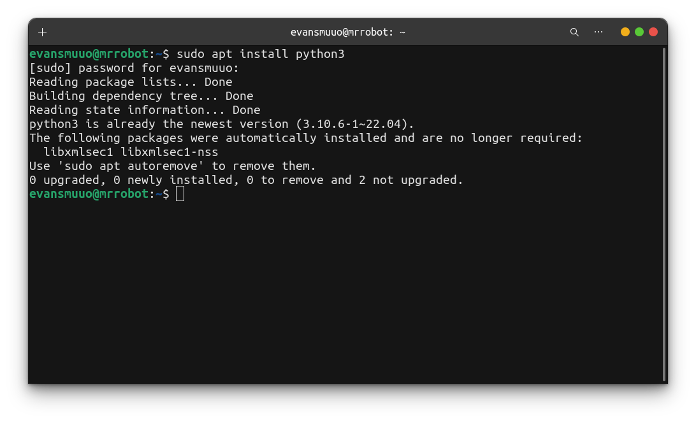

Would you like to build sleek web applications or to automate some monotonous tasks? If the answer is  yes to any of those python is the perfect programming language for you to learn right now. The following couple of weeks I will be posting a  new blog everyday on this new series on how to master python programming.By the end of 8 weeks you will be a master python programmer.

The best and fastest way to learn how to code is by coding, that is why before we beigin learning, it's good to have working python environments in your systems. I will quickly show you how to install python3 which is the latest release of python on all the major operating sysytems. `mac`, `linux`, and `windows`.

For `linux` users, you can use the following commands:
```console
sudo apt update && sudo apt upgrade 
```
The abovove command will update your system and the one below will install python in your system.
```console
sudo apt install python3
```


To install python3 on `windows` visit the official python donwloads [page](https://python.org) na download the `.exe` file for your version of windows.

For mac users the there are two ways you can install python in your machine. By downloading the insaller file and installing it manually into your system or the easy way using the terminal.
For the purpose of this tutorial we will install the terminal way, which is the easiest.You just need to run the following commands on your terminal:

```console
brew update && brew upgrade 
```
To update your system. Once your system is upgraded you can run the following command to install python.
```console
brew install python3
```
There you go you now have the latest version of python running in your system and you can [start learning](https://muuo.codes/posts/learnpython/whatispython/) how to code.
